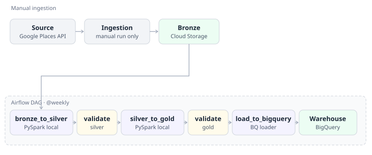

# Bangkok Hidden Gems

A GCP data pipeline that scores Bangkok cafes and bakeries by how much their rating outperforms the typical rating in their own district — surfacing places that are genuinely good but not yet widely reviewed.



## What it does

Google Places data alone doesn't tell you which cafes are "hidden gems" — a 4.8-rated place with 500 reviews isn't hidden, and a 5.0 with 2 reviews isn't trustworthy. This pipeline pulls cafe/bakery data across Bangkok, computes the median rating for each *khet* (district), and scores every place by how far it sits above its own district's median.

## Tech stack

| Layer | Tool |
|---|---|
| Source | Google Places API (New) |
| Processing | PySpark |
| Data lake (bronze/silver/gold) | Google Cloud Storage |
| Warehouse | BigQuery |
| Orchestration | Apache Airflow |
| Language | Python |

## Pipeline stages

- **Bronze** — raw Places API responses, tiled across a grid of search circles covering Bangkok, deduplicated by place ID, written to GCS untouched.
- **Silver** — flattened and cleaned: nested fields unpacked, price level mapped to a numeric scale, district (`khet`) and province parsed from the formatted address, non-Bangkok and non-English-address records dropped, merged across ingestion runs by place ID.
- **Gold** — split into two tables. `scored_places` holds places with enough reviews (≥5) in a district with enough comparable places (≥5) to trust a median against. `unqualified_places` holds everything else, tagged with why it didn't qualify.

## Scoring logic

For each district, the median rating is computed only from places with at least 5 reviews — low-review places are excluded from *shaping* the median, not just from being scored against it. A district needs at least 5 such places before its median is trusted at all; districts below that are set aside rather than scored off a shaky sample.

```
gem_score = place_rating - khet_median_rating
```

A positive score means the place rates above what's typical for its district.

**Example output (`scored_places`, illustrative — not real listings):**

| name | khet | category | rating | user_rating_count | khet_median_rating | gem_score |
|---|---|---|---|---|---|---|
| Little Leaf Cafe | Watthana | cafe | 4.8 | 12 | 4.2 | 0.6 |
| Baan Kanom Bakery | Bang Kapi | bakery | 4.7 | 8 | 4.3 | 0.4 |
| Sathorn Grind | Sathorn | cafe and bakery | 4.5 | 34 | 4.3 | 0.2 |

## Design decisions

- **Bangkok only.** The ingestion grid extends slightly past Bangkok's border into neighboring provinces; silver keeps only records where province resolves to `"Bangkok"` or `"Krung Thep Maha Nakhon"`.
- **English-formatted addresses only.** Google returns some addresses in Thai script depending on the place's language metadata; records with Thai-script district/province are dropped rather than parsed inconsistently.
- **No transit-distance feature.** Distance to BTS/MRT was considered and deliberately left out — it isn't part of what "hidden gem" means here.
- **No NLP.** Scoring is built entirely from structured fields (rating, review count, price level) — no review text processing.
- **The DAG doesn't call the Places API.** Ingestion is a separate, manually-run script. The DAG orchestrates `bronze_to_silver → silver_to_gold → load_to_bigquery` against an existing bronze snapshot, to avoid incurring API costs on every scheduled run.
- **Two service accounts.** One scoped to GCS (read/write), one scoped to BigQuery (read GCS, write BigQuery) — least-privilege rather than one account holding every permission.

## Setup

```
python -m venv .venv
source .venv/bin/activate
pip install -r requirements.txt
```

Copy `.env.example` to `.env` and fill in:
- `GOOGLE_PLACES_API_KEY`
- `GCP_PROJECT_ID`
- `GCS_BUCKET_NAME`
- `BIGQUERY_DATASET`
- `GCS_SERVICE_ACCOUNT_KEY_PATH`
- `BIGQUERY_SERVICE_ACCOUNT_KEY_PATH`
- `GCS_CONNECTOR_JAR_PATH`

The GCS connector jar for PySpark is downloaded separately (not committed — see `spark.jars` config in `bronze_to_silver.py` / `silver_to_gold.py`):

```
curl -f -o gcs-connector-hadoop3-latest.jar \
  https://storage.googleapis.com/hadoop-lib/gcs/gcs-connector-hadoop3-latest.jar
```

**Run the pipeline manually:**
```
python src/ingest/places_api_client.py
python src/loader/upload_to_gcs.py data/raw/bronze_places_raw.json
python src/transform/bronze_to_silver.py --input <bronze gs:// path> --output <silver gs:// path> --run-date YYYY-MM-DD
python src/transform/silver_to_gold.py --input <silver gs:// path> --output <gold gs:// path>
python src/loader/load_to_bigquery.py --project <gcp-project-id> --gold-path <gold gs:// path>
```

**Run via Airflow:**
```
airflow standalone
```
Point `dags_folder` in `airflow.cfg` at this repo's `dags/` folder, unpause `hidden_gems_pipeline` in the UI, and trigger it.

## Repo structure

```
bangkok-hidden-gems/
├── dags/
│   └── hidden_gems_pipeline_dag.py
├── src/
│   ├── ingest/
│   │   └── places_api_client.py
│   ├── transform/
│   │   ├── bronze_to_silver.py
│   │   └── silver_to_gold.py
│   ├── loader/
│   │   ├── upload_to_gcs.py
│   │   └── load_to_bigquery.py
│   └── validate/
│       ├── validate_silver.py
│       └── validate_gold.py
├── tests/
│   ├── conftest.py
│   ├── test_places_api_client.py
│   ├── test_bronze_to_silver.py
│   └── test_silver_to_gold.py
├── notebooks/
│   ├── silver_explore.ipynb
│   └── gold_explore.ipynb
├── docs/
│   └── architecture.svg
├── requirements.txt
├── pytest.ini
├── .env.example
└── .gitignore
```